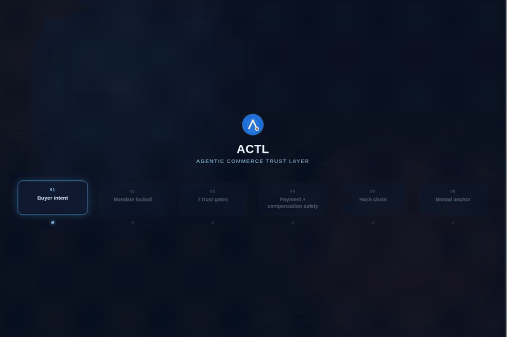
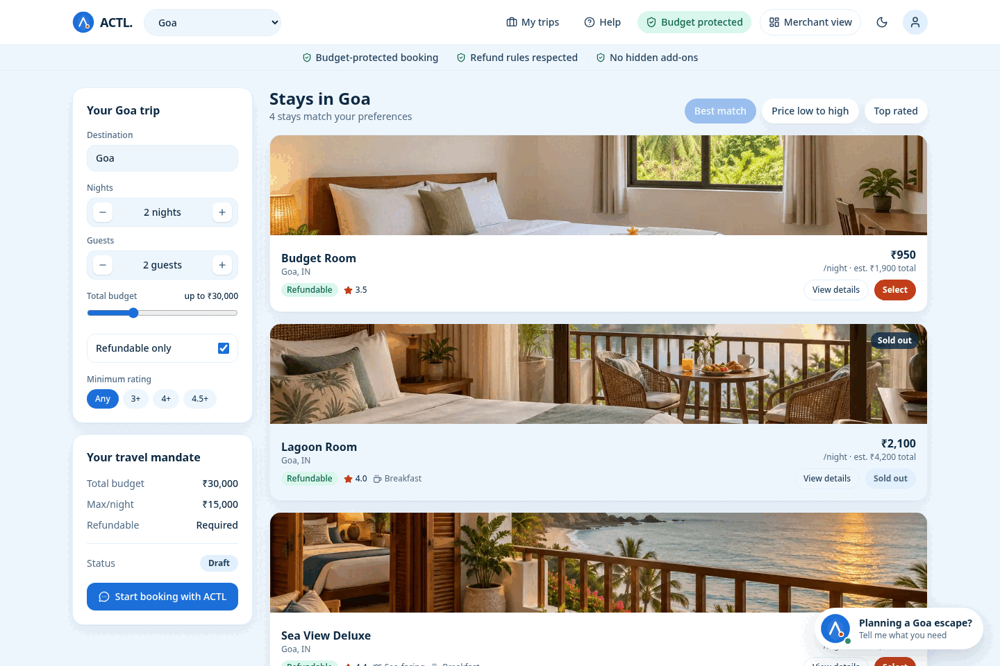
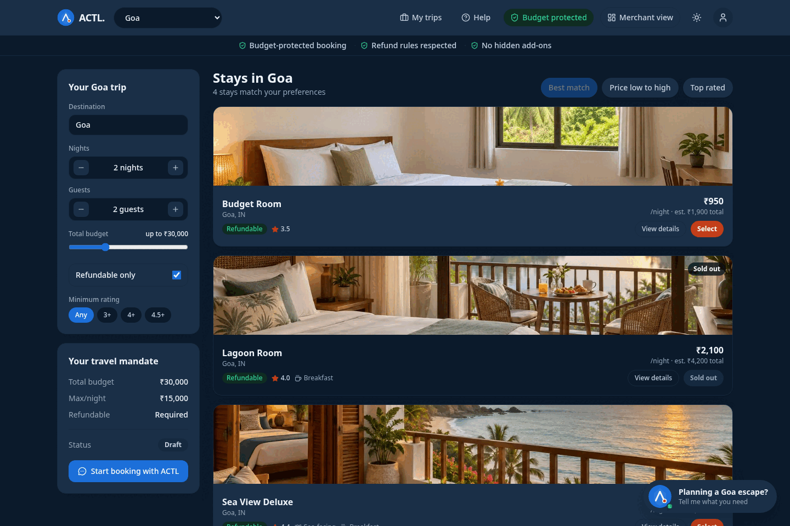
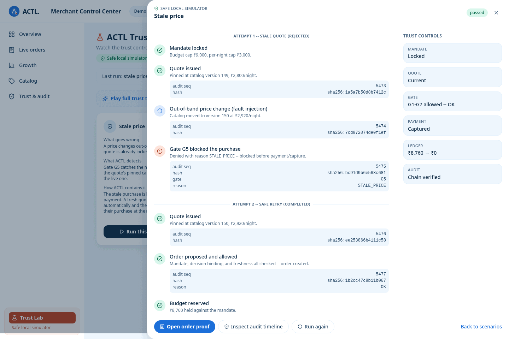
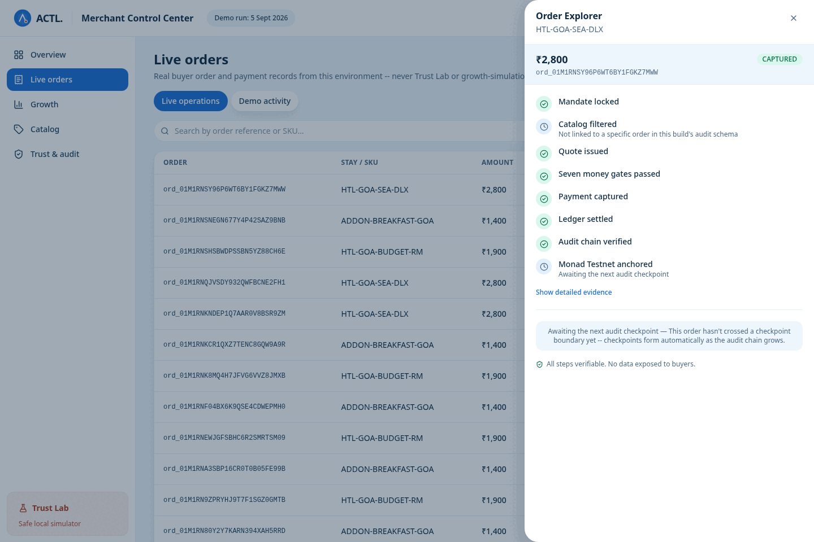
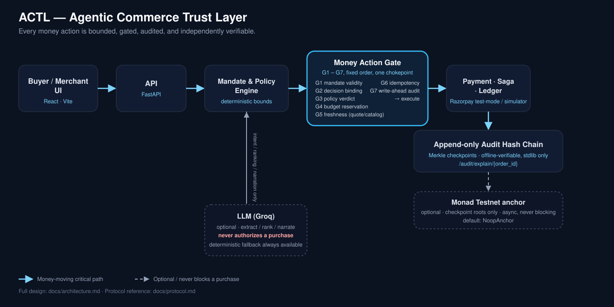
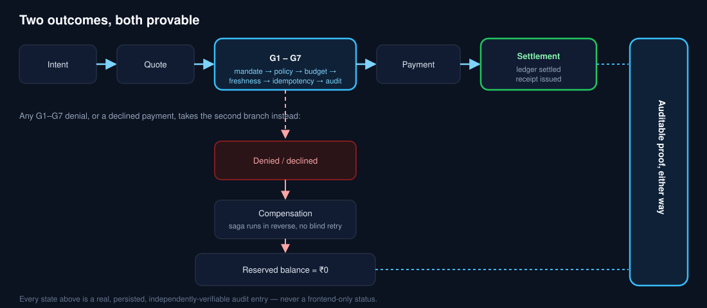
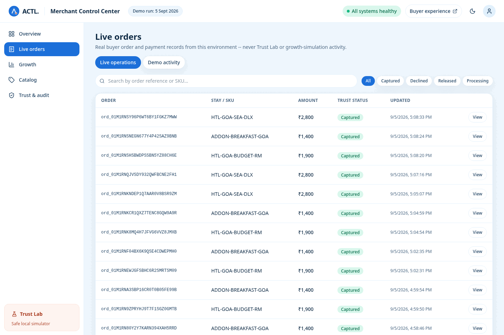

<div align="center">



# Autonomous commerce needs a trust layer.

**Bound every agent action. Verify every payment. Prove every outcome.**

AI buyer agents can already discover, choose, and pay. ACTL — the Agentic
Commerce Trust Layer — is the merchant-side backend and control plane that
makes that safe: every money action is bounded by a signed spending
mandate, gated through one deterministic chokepoint before any charge, and
recorded in an append-only, hash-chained audit log a third party can
verify offline with nothing but Python's standard library.

[Reviewer path](#reviewer-path) ·
[How it works](#how-it-works) ·
[Buyer journey](#buyer-journey) ·
[Merchant + Trust Lab](#merchant--trust-lab) ·
[Architecture](docs/architecture.md) ·
[Protocol](docs/protocol.md)

</div>

---

## Reviewer path

Fresh clone, no existing virtual environment, no local database state, no
`.env`, no Razorpay/Groq/Monad credentials — simulator payments and a
deterministic LLM fallback only:

```bash
git clone https://github.com/nipunkalsotra/actl.git
cd actl
./scripts/clone_to_demo.sh
```

This one script:

- creates an isolated Postgres + Redis (its own disposable Compose
  project, dynamic host ports — never touches an ACTL stack you already
  have running locally);
- generates a safe reviewer `.env` (simulator payments, LLM off);
- runs `alembic upgrade head`;
- seeds the six curated demo-partner hotels;
- runs the six [demo scenarios](#verification-and-failure-handling) and
  checks every trace byte-for-byte against committed golden fixtures;
- tears itself down automatically at the end.

No real Razorpay, Groq, or Monad secret is ever required. A real run of
this exact script against this exact repository just completed in
**28 seconds** (target: under 120s) — see
[Verification and failure handling](#verification-and-failure-handling) for the full, real output.

Want the buyer + merchant **UI** running locally instead (or as well)?

```bash
./start.sh
```

starts the real backend and the buyer + merchant Vite frontend together
with the same safe defaults, and leaves them running:

```text
ACTL is ready
Buyer:    http://localhost:5173/
Merchant: http://localhost:5173/merchant
Backend:  http://127.0.0.1:8000/docs
Logs:     ./logs.sh
Stop:     ./stop.sh
```

`./status.sh` shows a compact health table; `./stop.sh` stops only what it
started; `./stop.sh --down` also stops Postgres/Redis. Full details:
[Local setup and configuration](#local-setup-and-configuration).

### Contents

1. [Reviewer path](#reviewer-path)
2. [The problem, and ACTL's answer](#the-problem-and-actls-answer)
3. [Product walkthrough](#product-walkthrough)
4. [How it works](#how-it-works)
5. [Trust controls and architecture](#trust-controls-and-architecture)
6. [Buyer journey](#buyer-journey)
7. [Merchant + Trust Lab](#merchant--trust-lab)
8. [Verification and failure handling](#verification-and-failure-handling)
9. [Monad Testnet anchor](#monad-testnet-anchor)
10. [Technology and repository map](#technology-and-repository-map)
11. [Local setup and configuration](#local-setup-and-configuration)
12. [Deliberate demo boundaries](#deliberate-demo-boundaries)
13. [Security](#security)
14. [Roadmap](#roadmap)

---

## The problem, and ACTL's answer

A normal checkout flow assumes a human is looking at the screen before
money moves. An agent acting on a user's behalf breaks that assumption —
and a normal checkout flow has no answer for what happens when the agent
is wrong, slow, or compromised.

| Risk | ACTL's control |
|---|---|
| Agent invents a budget the user never stated | Evidence-bound mandate extraction — every monetary value must be present in the user's own text, never inferred |
| Price changes between quote and charge | Quote pinned to catalog version + price; **Gate G5** rejects a stale quote before payment |
| Agent overspends against the user's real limits | Row-locked budget **reservation** (Gate G4) + the deterministic **policy engine** (Gate G3) |
| Retry causes a duplicate charge | **Idempotency** (Gate G6) — same intent, same key, exactly one charge |
| Payment provider fails or times out | Durable **saga compensation** + a reconciliation poller — no charge is ever left orphaned |
| LLM is unavailable, rate-limited, or hallucinates | Deterministic fallback on every LLM call; the **LLM never authorizes a purchase** |
| Evidence is tampered with after the fact | **Append-only hash chain** + Merkle checkpoints, verifiable offline with zero dependencies |
| "Trust us" isn't good enough for a third party | Optional **Monad Testnet anchor** of checkpoint roots — external, independent timestamping |

Full traceability matrix: [`docs/architecture.md`](docs/architecture.md).

---

## Product walkthrough

Two short clips, both recorded from the real running application against
the real backend (simulator payments, LLM disabled) — nothing staged,
nothing hand-edited.

<table>
<tr>
<td width="50%" align="center">

**Buyer journey**
<br>

<br>
<sub>Intent → mandate lock → budget-filtered selection → checkout → separately-approved upsell</sub>

</td>
<td width="50%" align="center">

**Merchant live operations**
<br>

<br>
<sub>A real booking lands in Live orders → real Order Explorer evidence opens</sub>

</td>
</tr>
</table>

<details>
<summary><b>Static screenshots</b> (buyer light/dark, Trust Lab, audit proof)</summary>
<br>

| | |
|---|---|
|  |  |
| Buyer — light mode | Buyer — dark mode |



Trust Lab — the stale-price scenario, showing the rejected attempt and the safe retry as two distinct, evidenced steps — never a bare "captured."



Order Explorer — the real causal timeline behind one settled order.

</details>

---

## How it works



### The seven gates

Every money action — a purchase, an upsell, anything that moves a
reservation or a charge — passes through exactly one chokepoint,
`execute_money_action`, which runs these in fixed order (source:
[`application/gate.py`](src/actl/application/gate.py)):

| Gate | Checks | Typical denial |
|---|---|---|
| **G1** | Mandate validity — re-read from the DB, signature verified, not expired/revoked | `MANDATE_EXPIRED`, `MANDATE_REVOKED` |
| **G2** | The policy decision is bound to *this* intent and still fresh | `DECISION_STALE`, `INTENT_MISMATCH` |
| **G3** | The policy verdict itself (deterministic rule engine) | any rule's own reason code |
| **G4** | Atomic, row-locked budget reservation | `BUDGET_EXCEEDED` |
| **G5** | Quote and catalog freshness | `STALE_PRICE`, `QUOTE_EXPIRED` |
| **G6** | Idempotency — same intent, same key, exactly once | duplicate absorbed silently |
| **G7** | Write-ahead audit entry, then execute | — |

G4 (reservation) must precede EXECUTE; G7 (write-ahead audit) must be the
last thing before it — never the reverse, in either order or in code.

### Two outcomes, both provable



A denial or a declined payment is not a dead end — it's compensation,
a real ledger release, and the same audit-chain evidence a settled order
gets.

---

## Trust controls and architecture

- **Domain is pure.** No I/O, no framework imports in `src/actl/domain/`
  — enforced by an import-linter contract, not a code-review convention.
- **Layers point inward.** `interfaces → application → domain`; the
  reverse is a broken build, not a lint warning.
- **Money touches exactly one adapter path.** Only the gate (or the
  provider factory) may import the Razorpay adapter.
- **The LLM is never on the money-moving path.** It extracts intent,
  ranks candidates, and narrates outcomes — always behind a
  deterministic fallback ([ADR 0012](docs/adr/0012-llm-never-authorizes.md)).
- **Hash chain over blockchain** for the audit trail itself — a Merkle-
  checkpointed, offline-verifiable log; Monad Testnet anchoring is
  optional external corroboration on top of it, not the source of truth
  ([ADR 0013](docs/adr/0013-hash-chain-over-blockchain.md)).
- **Reservations over balance checks** — a row-locked ledger reservation,
  never a read-then-write balance race
  ([ADR 0014](docs/adr/0014-reservations-over-balance-checks.md)).

<details>
<summary>Full architectural decision record index</summary>

- [0001 — P0 foundation deviations](docs/adr/0001-p0-foundation-deviations.md)
- [0002 — P1 domain decisions](docs/adr/0002-p1-domain-decisions.md)
- [0003 — P2 persistence decisions](docs/adr/0003-p2-persistence-decisions.md)
- [0004 — P3 trust layer decisions](docs/adr/0004-p3-trust-layer-decisions.md)
- [0005 — P4 catalog/quote decisions](docs/adr/0005-p4-catalog-quote-decisions.md)
- [0006 — P5 payments decisions](docs/adr/0006-p5-payments-decisions.md)
- [0007 — P6 gate/ledger/saga decisions](docs/adr/0007-p6-gate-ledger-saga-decisions.md)
- [0008 — P7 agent protocol decisions](docs/adr/0008-p7-agent-protocol-decisions.md)
- [0009 — P8 LLM decisions](docs/adr/0009-p8-llm-decisions.md)
- [0010 — P9 failure theatre decisions](docs/adr/0010-p9-failure-theatre-decisions.md)
- [0011 — Modular monolith](docs/adr/0011-modular-monolith.md)
- [0012 — LLM never authorizes](docs/adr/0012-llm-never-authorizes.md)
- [0013 — Hash chain over blockchain](docs/adr/0013-hash-chain-over-blockchain.md)
- [0014 — Reservations over balance checks](docs/adr/0014-reservations-over-balance-checks.md)
- [0015 — Two payment adapters](docs/adr/0015-two-payment-adapters.md)
- [0016 — P11 Monad anchoring decisions](docs/adr/0016-p11-monad-anchoring-decisions.md)

</details>

Full design: [`docs/architecture.md`](docs/architecture.md). Agent wire
protocol reference: [`docs/protocol.md`](docs/protocol.md). Operator
runbook (detection/containment/recovery for all ten failure modes):
[`docs/runbook.md`](docs/runbook.md).

---

## Buyer journey


1. **Intent is collected** through a short conversational exchange —
   "book me something nice in Goa" — never inventing a number the buyer
   didn't state.
2. **Missing critical bounds are clarified** — budget, nights, refund
   requirement — with a deterministic fallback form when no LLM is
   configured or available.
3. **The buyer receives a constrained choice**: only curated demo-partner
   inventory that already fits the locked mandate's budget and refund
   policy.
4. **A quote is locked** to the current catalog version and price —
   the exact value Gate G5 will re-check before any charge.
5. **The buyer explicitly selects and confirms** — no purchase happens
   from a ranking alone.
6. **An optional upsell is offered separately**, after the base booking
   is already settled — never bundled, never pre-selected, requiring its
   own explicit approval and its own mandate.
7. **Payment and proof complete** — a real settlement, a real receipt,
   and a link straight into the same causal timeline a merchant sees.

---

## Merchant + Trust Lab

The Merchant Control Center is fully data-driven — it starts honest and
empty, and only ever reflects persisted, real backend state:

- **Fresh state.** Zero organic orders renders "No live bookings yet" —
  never a fabricated number, a sample chart, or a placeholder row.
- **A real booking updates it live.** Live orders, revenue, conversion,
  and audit/proof counters all move from persisted data — polled every
  15 seconds while the page is open, and invalidated immediately after a
  buyer completes checkout or an upsell in the same session.
- **Demo activity stays separate.** Trust Lab runs (`orders.source =
  'demo_lab'`) and growth-simulation sessions (`'growth_simulation'`)
  live in their own "Demo activity" view — never mixed into real order
  counts, KPIs, or charts.



**Trust Lab** is the explicitly separate demo tool: four real, replayable
failure scenarios, each narrated as **Detected → Contained → Terminal
state → Buyer protection**, driven entirely by real, persisted audit
evidence — never a frontend-simulated timeline.

| Scenario | Detected | Contained | Terminal state |
|---|---|---|---|
| **Stale price** | Gate G5 catches a catalog price mutated after the quote was pinned | Purchase blocked before payment; one automatic re-quote | Safe retry completes at the fresh price |
| **Provider decline** | Payment provider declines the capture | Saga runs compensation in reverse | Reservation released to ₹0, no charge |
| **LLM unavailable** | Every LLM call fails by design | Deterministic fallback extraction/ranking answers instead | Booking completes; no money decision ever touched the LLM |
| **Audit chain verification** | — | Every entry hash and Merkle checkpoint recomputed live | Real aggregate counts, honestly labeled anchored/unanchored |


---

## Verification and failure handling

Every number below is this repository's actual, current output — not a
number preserved from an earlier draft.

```text
$ make lint
ruff check .        -> All checks passed!
mypy src             -> Success: no issues found in 139 source files
lint-imports         -> Contracts: 6 kept, 0 broken

$ PAYMENT_PROVIDER=simulator pytest tests -q
637 passed, 1 skipped

$ make chaos            # all ten §20 failure modes, F1-F10
14 passed

$ npm --prefix web run build   -> clean
$ npm --prefix web run lint    -> clean

$ npx playwright test          # web/
83 passed, 83 skipped (intentional platform/mode-specific skips), 0 failed

$ scripts/clone_to_demo.sh
clone-to-demo complete: 28s (target: under 120s)
```

### What we tested

| Layer | Command | Result |
|---|---|---|
| Unit / property / architecture fitness | `pytest tests/unit tests/property tests/architecture -q` | **298 passed** |
| Integration (real Postgres + Redis via testcontainers) | `pytest tests/integration -q` | **289 passed, 1 skipped** |
| Contract (schema/property-based fuzzing) | `pytest tests/contract -q` | **19 passed, 3 subtests** |
| Chaos — all ten F1–F10 failure modes | `make chaos` | **14 passed** |
| Golden audit trace fixtures | `pytest tests/golden -q` | **15 passed** |
| Concurrency (50-way parallel ledger reservation) | `pytest tests/concurrency -q` | **2 passed** |
| End-to-end UI (Chromium desktop + mobile emulation) | `npx playwright test` | **83 passed**, 83 intentional skips |
| Offline audit bundle verify (zero dependencies, `actl` unimportable) | `make bundle && python3 verify_bundle.py` | **CHAIN VALID**, gapless |
| Clone-to-demo reviewer path | `scripts/clone_to_demo.sh` | **28s**, all 6 scenarios PASS |

<details>
<summary>The ten failure modes (F1–F10), detection signal and recovery</summary>

| # | Failure | Detected by | Auto-recovered |
|---|---|---|---|
| F1 | Price changes between quote and order | `STALE_PRICE` on `order.proposed` | Yes — one auto re-quote |
| F2 | Payment declined by the provider | `PROVIDER_DECLINED`, saga `C2_VOID`/`C1_RELEASE` | Yes — compensation |
| F3 | Webhook never arrives | `payload.source="reconciler"` | Yes — reconciliation poller |
| F4 | Duplicate webhook delivery | second delivery returns `outcome=duplicate` | Yes — absorbed silently |
| F5 | Provider timeout on order creation | `TransientProviderError` | Yes — bounded retry, same idempotency key |
| F6 | LLM unavailable or rate-limited | `RankingResult.degraded=true` | Yes — deterministic fallback |
| F7 | LLM names a nonexistent SKU | same `degraded=true` signal as F6 | Yes — deterministic fallback |
| F8 | Mandate expires mid-flight | `MANDATE_EXPIRED` at Gate G1 | **No — `actl sweep` is a manual step** |
| F9 | Concurrent requests exceed the cap together | `BUDGET_EXCEEDED` at Gate G4 | Yes — real Postgres row lock |
| F10 | Audit chain integrity broken | `actl verify-chain` reports `CHAIN BROKEN` | **No — halts and waits for a human** |

Full detection/containment/recovery/escalation steps for each:
[`docs/runbook.md`](docs/runbook.md).

</details>

```bash
# Recompute and validate the audit hash chain against the live database
uv run python -m actl.cli verify-chain --from 1 --to <seq>

# Export a self-contained, offline-verifiable evidence bundle
make bundle
python3 audit_bundle/verify_bundle.py
```

`verify_bundle.py` ships with the canonicalization/hashing logic copied
verbatim (never reimplemented), and a real test proves it verifies with
`actl` deliberately unimportable, no database, no network, no secret.

---

## Monad Testnet anchor

ACTL's audit trail is already a complete, offline-verifiable hash chain
on its own — Monad Testnet anchoring is optional, external
corroboration on top of it, not a dependency of it.

- **What gets anchored:** Merkle checkpoint roots only. Never a customer
  payload, a payment detail, or any business data.
- **Never on the critical path:** an async worker loop publishes roots;
  a Monad outage can never block a purchase, a ledger action, or an
  audit append.
- **Testnet proof, not production infrastructure** — `NoopAnchor` is the
  default; anchoring only runs with `ANCHOR_PROVIDER=monad` explicitly set.

```bash
uv run python -m actl.cli verify-anchor --to <checkpoint_to_seq>
```

**Live Testnet proof** (real, deployed, publicly verifiable):

- Contract — [`0x551983E7b577Eb2FAF3163BCA9a5d4ACfB577C1B`](https://testnet.monadscan.com/address/0x551983E7b577Eb2FAF3163BCA9a5d4ACfB577C1B)
- First checkpoint anchor transaction — [`0x8010cdf3…37ff47`](https://testnet.monadscan.com/tx/0x8010cdf387dc6890126c4f4c2ff7abb84411bd260604157ad0b11e473737ff47)

Full docs, deployment steps, and failure/retry behavior:
[`docs/monad-testnet.md`](docs/monad-testnet.md). Design rationale:
[ADR 0016](docs/adr/0016-p11-monad-anchoring-decisions.md).

---

## Technology and repository map

**Backend:** Python, FastAPI, PostgreSQL, Redis, SQLAlchemy (async),
Alembic. **Frontend:** React, Vite, TypeScript, TanStack Query,
Playwright. **Payments:** Razorpay test mode, or a deterministic
in-process simulator. **LLM:** Groq (optional; deterministic fallback
always available). **On-chain:** Solidity (Foundry) — optional Monad
Testnet checkpoint anchoring.

```text
src/actl/
├── domain/            pure business rules — no I/O, no framework imports
├── application/        use cases: gate.py (the money chokepoint), saga, audit
├── infrastructure/     Postgres/Redis repos, Razorpay + simulator adapters,
│                       LLM client, Monad anchor client
├── interfaces/         FastAPI routers (agent, buyer, merchant, admin, audit)
└── platform/           clock, ids, tracing, redaction, retry — cross-cutting

web/src/                Buyer + Merchant React app (Vite, TanStack Query)
web/tests/               Playwright end-to-end suite

migrations/              Alembic schema history
tests/                  unit · property · architecture · integration · contract
                        · chaos (F1–F10) · golden (fixture) suites
fixtures/               committed golden traces + LLM replay cassettes
chain/                  Foundry project — AuditCheckpointAnchor.sol + deploy script
scripts/                clone_to_demo.sh, demo.sh, export_audit_bundle.py, seed.py
docs/                   architecture.md, protocol.md, runbook.md,
                        monad-testnet.md, adr/
```

---

## Local setup and configuration

Requirements: Docker, `uv`, Node.js (for the frontend). No `.env` needed
for the reviewer path — every setting has a safe, test-mode default
(`config.py`); copy `.env.example` to `.env` only to point at a real
Razorpay test-mode account or a real Groq key.

```bash
make up            # Postgres + Redis
make migrate       # alembic upgrade head
make seed          # the six curated Goa demo-partner hotels
uv run uvicorn actl.main:app --reload   # API on :8000
uv run python -m actl.worker            # background worker (webhooks, reconciliation)
```

`make lint` (ruff + mypy --strict + import-linter contracts), `make test`
(unit + property + architecture), `make chaos` (all ten F1–F10 failure
modes), `make verify` (live chain + golden-fixture check) are the same
gates CI runs (`.github/workflows/ci.yml`).

This is a 100%-free-tier, test-mode-only build. `config.py` refuses to
start if `RAZORPAY_KEY_ID` doesn't begin with `rzp_test_` — a real live
key cannot be configured by accident.

### Resetting local demo data

The Merchant dashboard reflects whatever this database actually holds.
There is no reset button in the UI, and it never wipes data on load. If a
judge/demo run needs a genuinely clean, empty state:

```bash
./stop.sh --down
docker volume rm actl_postgres_data
make up && make migrate && make seed
./start.sh
```

Local-only by construction — this operates on `docker-compose.yml`'s own
named volume for this checkout, never a remote database, and there is no
HTTP route that performs it.

---

## Deliberate demo boundaries

- **Curated demo-partner inventory**, not live OTA/hotel-supplier
  availability — six fixed Goa properties for a reproducible,
  judgeable demo, never presented as a real accommodation reservation.
- **Razorpay Test Mode, or a deterministic simulator** for the reviewer
  journey — never a real charge.
- **Monad Testnet only** — optional anchor, never mainnet, never a
  production dependency.
- **Real Razorpay/Groq/Monad credentials remain fully opt-in** — never
  required to run the demo end to end.
- **Travel fulfillment itself is out of scope.** This is a trust-layer
  demonstration for agentic payment safety, not a booking engine.
- **Frontend build/lint/Playwright are not yet wired into CI** —
  `.github/workflows/ci.yml` currently gates the backend (lint, unit,
  integration, golden, chaos, contract, demo scenarios, chain +
  bundle verification); the frontend suite above is run and reported
  here manually, not yet as a CI gate.
- **No generic outbox relay or DLQ drainer** — audit checkpointing is
  synchronous, in the same transaction as the entry that crosses a
  checkpoint boundary.
- **`catalog.queried` audit entries carry no mandate/order linkage** — a
  buyer can browse before choosing anything, so `GET
  /audit/explain/{order_id}` cannot correlate a catalog read back to one
  order.
- **Mandate issuance is out of this merchant-side build's scope** — a
  mandate arrives already locked and signed from the buyer-agent's own
  system.

---

## Security

- Every secret-bearing setting (`RAZORPAY_KEY_SECRET`,
  `RAZORPAY_WEBHOOK_SECRET`, `GROQ_API_KEY`, `QUOTE_SIGNING_KEY`,
  `MANDATE_SIGNING_KEY`, `ADMIN_TOKEN`, `READ_TOKEN`,
  `MERCHANT_PRIVATE_KEY_HEX`) has a placeholder test-mode default and is
  redacted by a key-pattern filter before any structured log line is
  rendered — proven by a canary-injection test, not assumed.
- `.env` is git-ignored; no real credential is ever committed.
- Two separate bearer-token tiers — `ADMIN_TOKEN` (demo-only catalog
  price mutation) and `READ_TOKEN` (read-only audit explain) — a
  reviewer/dashboard credential can never also mutate the catalog.
- `capture()` is unreachable unless the Razorpay Checkout signature
  verifies; a tampered signature yields a declined, compensated saga,
  never a charge.
- The LLM never authorizes a purchase; every call is schema-validated,
  budget-capped, and behind a deterministic fallback the money path
  never blocks on.
- Agent-to-agent messages are Ed25519-signed and replay-protected; an
  HMAC "development fallback" signing mode is refused outside pytest by
  a startup check. Full protocol reference:
  [`docs/protocol.md`](docs/protocol.md).

**Reporting a security issue:** please open a private security advisory
on this repository rather than a public issue.

---

## Roadmap

**P0–P11 implemented and green** (backend); **frontend (Buyer + Merchant
UI, Trust Lab) implemented, verified locally, not yet CI-gated** — see
[Deliberate demo boundaries](#deliberate-demo-boundaries).

| Phase | Delivered |
|---|---|
| P0 | Foundation — config, platform primitives, import-linter contracts |
| P1 | Domain core — mandate model, canonical JSON, the policy engine |
| P2 | Persistence — schema, repositories, transactional outbox |
| P3 | Trust layer — append-only hash chain, Merkle checkpoints, verifier |
| P4 | Catalog, agent feed, price locks |
| P5 | Payments adapter, webhooks, reconciliation |
| P6 | Money Action Gate, ledger, saga |
| P7 | Agent protocol — signed agent-to-agent commerce |
| P8 | LLM layer — Groq, guardrails, deterministic fallback |
| P9 | Failure theatre — all ten F1–F10 modes, golden traces, runbook |
| P10 | Observability — traces, metrics, `/audit/explain`, offline bundle |
| P11 | Optional Monad Testnet anchoring — owner-controlled contract, async worker, opt-in verifier |
| — | Buyer + Merchant UI, Trust Lab, data-driven Merchant dashboard, organic/demo separation |

Next: CI-gate the frontend suite; extend curated inventory categories
beyond travel.hotel.

See [`docs/architecture.md`](docs/architecture.md) §28 for full phase
exit criteria and [`docs/runbook.md`](docs/runbook.md) for failure-mode
operating procedure.
